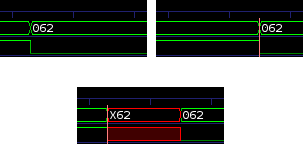

vcdmerge



Merges  two  vcd  files  to generate a third one.  The output file will
have `x' bits where the input signals differ.  Can be used  to  massage
verilog vvp dump files to more closely resemble reality.

Here the term `.vcd' refers to a `Value Change Dump', a file format 
used by logic circuit simulation tools.
https://en.wikipedia.org/wiki/Value_change_dump

GPLv3 Licensed

run:

```
make all
make install prefix="/usr"
```

(the second one as root)
To build and install. 

